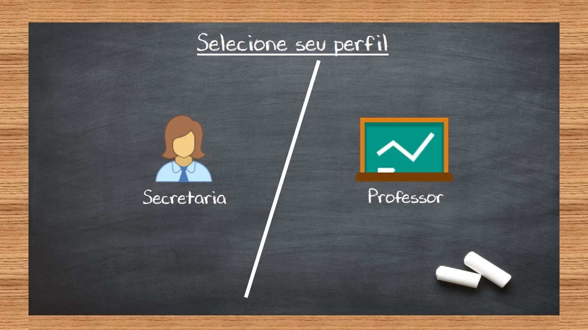
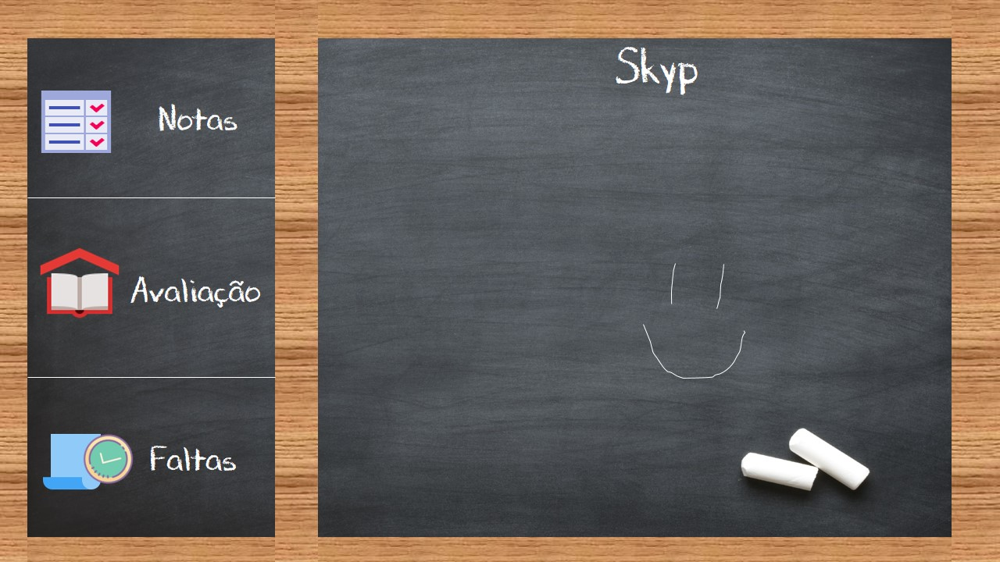
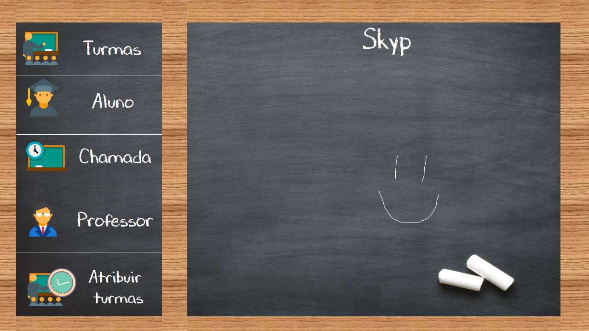

# Projeto-Skyp 2018
O projeto Skyp tem o intuito de ser um diario escolar digital com a proposta de serem planilhas editáveis simples, onde o professor controla chamadas e notas dos alunos e a secretaria os cadastros pertinentes, com o aplicativo também é possível os alunos terem um perfil para consultar as devidas notas, esse aplicativo desenvolvido para a plataforma desktop e mobile foi desenvolvido em 2018 para a conclusão do meu curso técnico de informática

 
 
 
 
 
 
 
 
 

# Sobre o software
Basicamente todas as telas são planilhas editáveis que permitem importação do excel, o aplicativo também tem um perfil para os alunos consultarem suas notas, a tentativa foi de ser uma forma mais intuitiva possível para lidar com dados massivos

# Um pouco da metodologia e alguns esboços do desenvolvimento

# Um pouco sobre como foi o desenvolvimento
Quando fiz esse

# Ferramentas utilizadas
  
* Java Swing para o desktop
* Api Webservice Rest Json feita em Java
* Aplicativo Multiplataforma feito com C# Xamarin
* Banco de dados MySQL
